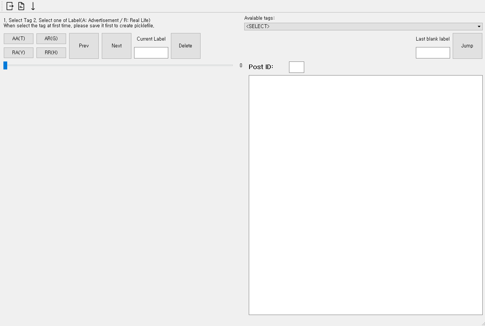

# InstaSpider

Get datas from Instagram, searching by hashtag

```
python >= 3.7
beautifulsoup4 
PyYAML
selenium
sqlite
tqdm
```

**Installation**

```bash
$ pip install -r requirements.txt
```

# Usage

1. Download the Chrome driver from [link](https://chromedriver.chromium.org/downloads) and change driver name and put into `chrome` folder as followings:
    - for windows users: `./chrome/chromedriver_win.exe`
    - for mac users: `./chrome/chromedriver_mac`
    - for linux users: `./chrome/chromedriver_linux`
2. Change your `settings.yaml`
    - Currently not supported for not login option, so should set `login=True`
3. Change or write your own code
    ```python
    from src import Spider

    tag = "food"
    sp = Spider("./settings.yaml")
    # Get datas from Web -> database
    sp.main(tag)
    # Extract datas from database -> output
    # if set it None, will extract all distinct tags
    sp.extract(tags=tags)  
    ```
4. Check you sqlite db
    ```python
    from src import Database, load_settings

    conf = load_settings("./settings.yaml")
    db = Database(**conf["db_settings"])
    sql = f"""SELECT * FROM {db.table_name} LIMIT 5"""
    c = db.get_cursor()
    res = c.execute(sql).fetchall()
    c.close()
    ```
5. Or you can try some presets:
    ```bash
    $ example.py --test 1 --settings_path ./settings.yaml --tags food drink
    # or
    $ example.py --test 2 --settings_path ./settings.yaml 
    ```

## Extraction from database

You can extract data from your database, the folder structure of `output` is like following:

* `tag{x}`: searched tags
* `id{x}`: unique database id + date + likes
* `info.txt`: contains the post text and hashtags, it can be possible that there is no hashtags or post
* `{x}.jpg`: images of the post (can be multiple)

```bash
InstaSpider
├── chorme
├── database
├── src
└── output
     ├── tag1  
     │    ├── id1  # databaseId
     │    │     ├── info.txt (uid, date, likes, postlink, post, hashtags)
     │    │     ├── 1.jpg
     │    │     └── 2.jpg
     │    └── id2
     └── tag2  # searched tag 2
```

## Labeler

We build a labeler program for our research.

```bash
$ python ./labelApp.py --settings_path ./settings.yaml
```



# TODO

- [x] ~~**TO BE FIXED** The first image always inserted twice~~
- [x] ~~**NEW** Finish Labeler~~
- [x] ~~**NEW** ~~Labeler: Progress Bar with jump to post immediately by double click~~
- [ ] **NEW** Split the extract process into different file
- [ ] **NEW** Hash the username in the post text(INTO a special token).
- [ ] **NEW** Check the right form of email to login

# License

MIT License

Copyright (c) 2021 Soo

Permission is hereby granted, free of charge, to any person obtaining a copy
of this software and associated documentation files (the "Software"), to deal
in the Software without restriction, including without limitation the rights
to use, copy, modify, merge, publish, distribute, sublicense, and/or sell
copies of the Software, and to permit persons to whom the Software is
furnished to do so, subject to the following conditions:

The above copyright notice and this permission notice shall be included in all
copies or substantial portions of the Software.

THE SOFTWARE IS PROVIDED "AS IS", WITHOUT WARRANTY OF ANY KIND, EXPRESS OR
IMPLIED, INCLUDING BUT NOT LIMITED TO THE WARRANTIES OF MERCHANTABILITY,
FITNESS FOR A PARTICULAR PURPOSE AND NONINFRINGEMENT. IN NO EVENT SHALL THE
AUTHORS OR COPYRIGHT HOLDERS BE LIABLE FOR ANY CLAIM, DAMAGES OR OTHER
LIABILITY, WHETHER IN AN ACTION OF CONTRACT, TORT OR OTHERWISE, ARISING FROM,
OUT OF OR IN CONNECTION WITH THE SOFTWARE OR THE USE OR OTHER DEALINGS IN THE
SOFTWARE.
